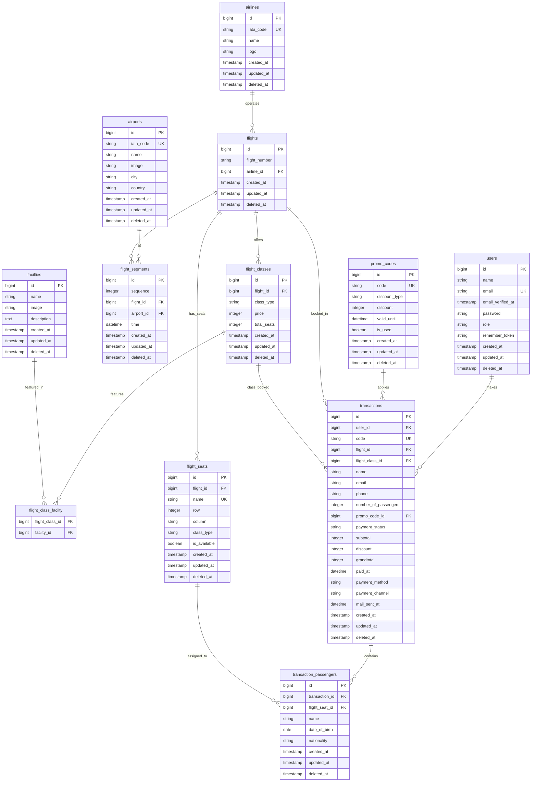

# Perancangan Database

## Entity Relationship Diagram (ERD)



## Relasi Antar Tabel

| Model | Relasi | Target | Foreign Key |
|-------|--------|--------|-------------|
| Flight | belongsTo | Airline | airline_id |
| Flight | hasMany | FlightSegment | flight_id |
| Flight | hasMany | FlightClass | flight_id |
| Flight | hasMany | FlightSeat | flight_id |
| FlightSegment | belongsTo | Airport | airport_id |
| FlightClass | belongsToMany | Facilty | flight_class_facilty |
| FlightClass | hasMany | FlightSeat | flight_id + class_type |
| Transaction | belongsTo | User | user_id |
| Transaction | belongsTo | Flight | flight_id |
| Transaction | belongsTo | FlightClass | flight_class_id |
| Transaction | belongsTo | PromoCode | promo_code_id |
| Transaction | hasMany | TransactionPassenger | transaction_id |
| TransactionPassenger | belongsTo | FlightSeat | flight_seat_id |

## Indexing Strategy

| Tabel | Index | Type | Tujuan |
|-------|-------|------|--------|
| transactions | user_id | B-tree | Lookup booking per user |
| transactions | payment_status | B-tree | Filter by status |
| transactions | code | UNIQUE | Pencarian kode booking |
| flight_seats | flight_id + class_type | Composite | Filter kursi per flight |
| flight_segments | flight_id + sequence | Composite | Urutan segmen |
| promo_codes | code | UNIQUE | Validasi kode promo |
| transaction_passengers | transaction_id | B-tree | Relasi penumpang |

## Migration Files

| File | Perubahan |
|------|-----------|
| `create_users_table` | Tabel users + soft deletes |
| `create_airlines_table` | Master maskapai |
| `create_airports_table` | Master bandara |
| `create_flights_table` | Data penerbangan |
| `create_flight_segments_table` | Segmen rute |
| `create_flight_classes_table` | Kelas harga |
| `create_facilties_table` | Fasilitas |
| `create_flight_class_facilty_table` | Pivot fasilitas |
| `create_flight_seats_table` | Kursi per penerbangan |
| `create_transactions_table` | Transaksi pemesanan |
| `create_transaction_passengers_table` | Penumpang per transaksi |
| `create_promo_codes_table` | Kode promo |
| `add_user_id_to_transactions_table` | Menambahkan user_id ke transactions |
| `fix_unsigned_columns` | Fix tipe kolom unsigned |
| `add_soft_deletes_to_users` | Soft deletes untuk users |
| `remove_redundant_indexes` | Membersihkan index redundant |

## OLAP View

```sql
CREATE VIEW olap_daily_summary AS
SELECT
  DATE(transactions.created_at) AS tanggal,
  COUNT(*) AS total_transaksi,
  SUM(grandtotal) AS total_pendapatan,
  AVG(grandtotal) AS rata_rata_transaksi,
  SUM(CASE WHEN payment_status = 'paid' THEN 1 ELSE 0 END) AS transaksi_lunas,
  SUM(CASE WHEN payment_status = 'pending' THEN 1 ELSE 0 END) AS transaksi_pending
FROM transactions
GROUP BY DATE(created_at);
```

## Konvensi Penamaan

- Tabel: plural snake_case (e.g., `flight_seats`)
- Kolom: singular snake_case (e.g., `payment_status`)
- Foreign key: `{tabel}_id` (e.g., `flight_id`)
- Primary key: `id`
- Soft deletes: `deleted_at`
- Timestamps: `created_at`, `updated_at`
