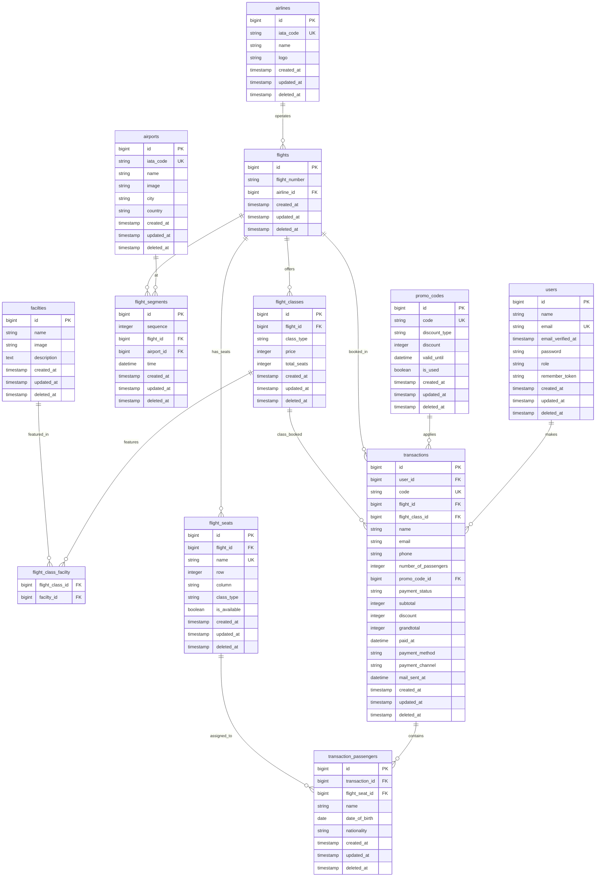

# Entity Relationship Diagram (ERD) - Garuda Flight Booking System

Dokumen ini menyajikan rancangan basis data lengkap sistem pemesanan tiket pesawat Garuda. Rancangan ini mencakup relasi antartabel, tipe data kolom, constraints, indexing, dan penjelasan struktural yang detail untuk mempermudah pemahaman arsitektur data.

## Diagram Hubungan Entitas (Mermaid)

Berikut adalah visualisasi hubungan antartabel menggunakan notasi Crow's Foot dalam format Mermaid:

---

## Kamus Data Lengkap (Data Dictionary)

Berikut adalah rincian kolom, tipe data, constraints, dan fungsi dari masing-masing tabel:

### 1. Tabel: users
Tabel master untuk menyimpan data otentikasi akun pengguna (Customer dan Admin/Staf).

| Nama Kolom | Tipe Data | Keterangan / Constraint | Deskripsi |
|---|---|---|---|
| id | bigint | PK, Auto Increment | Identifier unik pengguna |
| name | string | Not Null | Nama lengkap pengguna |
| email | string | UK, Not Null | Alamat surel aktif untuk login |
| email_verified_at| timestamp | Nullable | Waktu konfirmasi email |
| password | string | Not Null | Hash password keamanan |
| role | string | Not Null | Peran pengguna (misal: 'customer', 'admin') |
| remember_token | string | Nullable | Token untuk fitur 'remember me' |
| created_at | timestamp | Not Null | Waktu pencatatan data |
| updated_at | timestamp | Not Null | Waktu pembaruan terakhir data |
| deleted_at | timestamp | Nullable | Pendukung soft deletes |

### 2. Tabel: airlines
Tabel master untuk menyimpan data maskapai penerbangan yang terdaftar pada sistem.

| Nama Kolom | Tipe Data | Keterangan / Constraint | Deskripsi |
|---|---|---|---|
| id | bigint | PK, Auto Increment | Identifier unik maskapai |
| iata_code | string | UK, Not Null | Kode IATA maskapai (misal: 'GA' untuk Garuda) |
| name | string | Not Null | Nama resmi maskapai penerbangan |
| logo | string | Not Null | Path lokasi penyimpanan gambar logo |
| created_at | timestamp | Not Null | Waktu pencatatan data |
| updated_at | timestamp | Not Null | Waktu pembaruan terakhir data |
| deleted_at | timestamp | Nullable | Pendukung soft deletes |

### 3. Tabel: airports
Tabel master untuk menyimpan data bandara keberangkatan dan tujuan penerbangan.

| Nama Kolom | Tipe Data | Keterangan / Constraint | Deskripsi |
|---|---|---|---|
| id | bigint | PK, Auto Increment | Identifier unik bandara |
| iata_code | string | UK, Not Null | Kode IATA bandara (misal: 'CGK', 'DPS') |
| name | string | Not Null | Nama resmi bandara |
| image | string | Not Null | Path lokasi gambar visualisasi bandara |
| city | string | Not Null | Nama kota lokasi bandara |
| country | string | Not Null | Nama negara lokasi bandara |
| created_at | timestamp | Not Null | Waktu pencatatan data |
| updated_at | timestamp | Not Null | Waktu pembaruan terakhir data |
| deleted_at | timestamp | Nullable | Pendukung soft deletes |

### 4. Tabel: flights
Tabel yang menampung jadwal penerbangan utama yang dioperasikan oleh maskapai.

| Nama Kolom | Tipe Data | Keterangan / Constraint | Deskripsi |
|---|---|---|---|
| id | bigint | PK, Auto Increment | Identifier unik jadwal penerbangan |
| flight_number | string | Not Null | Nomor penerbangan (misal: 'GA-102') |
| airline_id | bigint | FK to airlines.id, Not Null | Referensi ke maskapai pengoperasi |
| created_at | timestamp | Not Null | Waktu pencatatan data |
| updated_at | timestamp | Not Null | Waktu pembaruan terakhir data |
| deleted_at | timestamp | Nullable | Pendukung soft deletes |

### 5. Tabel: flight_segments
Tabel transit rute untuk mencatat urutan bandara yang disinggahi oleh satu jadwal penerbangan.

| Nama Kolom | Tipe Data | Keterangan / Constraint | Deskripsi |
|---|---|---|---|
| id | bigint | PK, Auto Increment | Identifier unik segmen penerbangan |
| sequence | integer | Not Null | Nomor urutan segmen rute (mulai dari 1) |
| flight_id | bigint | FK to flights.id, Not Null | Referensi ke penerbangan terkait |
| airport_id | bigint | FK to airports.id, Not Null | Referensi ke bandara persinggahan |
| time | datetime | Not Null | Waktu keberangkatan/kedatangan di bandara ini |
| created_at | timestamp | Not Null | Waktu pencatatan data |
| updated_at | timestamp | Not Null | Waktu pembaruan terakhir data |
| deleted_at | timestamp | Nullable | Pendukung soft deletes |

### 6. Tabel: flight_classes
Tabel yang mendefinisikan jenis kelas kabin (Economy, Business, dll) beserta harga dasar di suatu penerbangan.

| Nama Kolom | Tipe Data | Keterangan / Constraint | Deskripsi |
|---|---|---|---|
| id | bigint | PK, Auto Increment | Identifier unik kelas penerbangan |
| flight_id | bigint | FK to flights.id, Not Null | Referensi ke penerbangan terkait |
| class_type | string | Not Null | Nama kelas penerbangan |
| price | integer | Not Null | Harga tiket dasar untuk kelas ini |
| total_seats | integer | Not Null | Jumlah total kapasitas kursi di kelas ini |
| created_at | timestamp | Not Null | Waktu pencatatan data |
| updated_at | timestamp | Not Null | Waktu pembaruan terakhir data |
| deleted_at | timestamp | Nullable | Pendukung soft deletes |

### 7. Tabel: facilties
Tabel master berisi ragam fasilitas kabin yang dapat ditawarkan ke penumpang.

| Nama Kolom | Tipe Data | Keterangan / Constraint | Deskripsi |
|---|---|---|---|
| id | bigint | PK, Auto Increment | Identifier unik fasilitas |
| name | string | Not Null | Nama fasilitas (misal: 'Baggage 20kg', 'Meals') |
| image | string | Not Null | Path gambar logo/ikon fasilitas |
| description | text | Not Null | Rincian lengkap mengenai fasilitas tersebut |
| created_at | timestamp | Not Null | Waktu pencatatan data |
| updated_at | timestamp | Not Null | Waktu pembaruan terakhir data |
| deleted_at | timestamp | Nullable | Pendukung soft deletes |

### 8. Tabel: flight_class_facilty
Tabel pivot pendukung relasi Many-to-Many antara kelas penerbangan dan fasilitas.

| Nama Kolom | Tipe Data | Keterangan / Constraint | Deskripsi |
|---|---|---|---|
| flight_class_id | bigint | FK to flight_classes.id, Not Null | Referensi ke kelas penerbangan terkait |
| facilty_id | bigint | FK to facilties.id, Not Null | Referensi ke fasilitas terkait |

### 9. Tabel: flight_seats
Tabel yang mencatat data kursi fisik pesawat beserta status ketersediaannya.

| Nama Kolom | Tipe Data | Keterangan / Constraint | Deskripsi |
|---|---|---|---|
| id | bigint | PK, Auto Increment | Identifier unik kursi |
| flight_id | bigint | FK to flights.id, Not Null | Referensi ke penerbangan terkait |
| name | string | UK, Not Null | Kode kursi (misal: '1A', '12F') |
| row | integer | Not Null | Posisi baris nomor kursi |
| column | string | Not Null | Posisi kolom abjad kursi |
| class_type | string | Not Null | Jenis kelas kursi (misal: 'economy', 'business') |
| is_available | boolean | Not Null, Default: true | Menentukan apakah kursi kosong/bisa dipesan |
| created_at | timestamp | Not Null | Waktu pencatatan data |
| updated_at | timestamp | Not Null | Waktu pembaruan terakhir data |
| deleted_at | timestamp | Nullable | Pendukung soft deletes |

### 10. Tabel: promo_codes
Tabel yang menyimpan daftar kupon kode promo aktif untuk pemotongan harga belanja transaksi.

| Nama Kolom | Tipe Data | Keterangan / Constraint | Deskripsi |
|---|---|---|---|
| id | bigint | PK, Auto Increment | Identifier unik kode promo |
| code | string | UK, Not Null | Kode promo unik (misal: 'MERDEKA78') |
| discount_type | string | Not Null | Tipe diskon (misal: 'fixed' atau 'percentage') |
| discount | integer | Not Null | Nilai nominal atau persentase potongan harga |
| valid_until | datetime | Not Null | Batas akhir waktu keaktifan promo |
| is_used | boolean | Not Null, Default: false | Menandakan keaktifan penggunaan kode promo |
| created_at | timestamp | Not Null | Waktu pencatatan data |
| updated_at | timestamp | Not Null | Waktu pembaruan terakhir data |
| deleted_at | timestamp | Nullable | Pendukung soft deletes |

### 11. Tabel: transactions
Tabel utama untuk pencatatan transaksi pemesanan tiket penerbangan oleh pengguna.

| Nama Kolom | Tipe Data | Keterangan / Constraint | Deskripsi |
|---|---|---|---|
| id | bigint | PK, Auto Increment | Identifier unik transaksi |
| user_id | bigint | FK to users.id, Not Null | Akun pembuat transaksi pemesanan |
| code | string | UK, Not Null | Kode unik transaksi untuk pelacakan |
| flight_id | bigint | FK to flights.id, Not Null | Penerbangan pilihan pengguna |
| flight_class_id | bigint | FK to flight_classes.id, Not Null | Kelas penerbangan pilihan pengguna |
| name | string | Not Null | Nama pemesan yang dapat dihubungi |
| email | string | Not Null | Email pemesan untuk pengiriman e-ticket |
| phone | string | Not Null | Nomor telepon pemesan untuk koordinasi |
| number_of_passengers| integer | Not Null | Jumlah total penumpang yang didaftarkan |
| promo_code_id | bigint | FK to promo_codes.id, Nullable | Kode promo terpasang |
| payment_status | string | Not Null, Default: 'pending'| Status pembayaran ('pending', 'paid', 'failed') |
| subtotal | integer | Not Null | Harga total tiket awal sebelum potongan |
| discount | integer | Not Null, Default: 0 | Jumlah potongan harga dari promo |
| grandtotal | integer | Not Null | Harga bersih akhir yang harus dibayarkan |
| paid_at | datetime | Nullable | Tanggal & waktu pelunasan pembayaran |
| payment_method | string | Nullable | Metode pembayaran yang dipilih |
| payment_channel | string | Nullable | Saluran pembayaran (misal: 'bank_transfer') |
| mail_sent_at | datetime | Nullable | Waktu pengiriman dokumen tiket elektronik |
| created_at | timestamp | Not Null | Waktu pencatatan data |
| updated_at | timestamp | Not Null | Waktu pembaruan terakhir data |
| deleted_at | timestamp | Nullable | Pendukung soft deletes |

### 12. Tabel: transaction_passengers
Tabel detail untuk menyimpan informasi individu setiap penumpang dalam suatu transaksi pemesanan.

| Nama Kolom | Tipe Data | Keterangan / Constraint | Deskripsi |
|---|---|---|---|
| id | bigint | PK, Auto Increment | Identifier unik detail penumpang |
| transaction_id | bigint | FK to transactions.id, Not Null | Referensi ke transaksi pemesanan induk |
| flight_seat_id | bigint | FK to flight_seats.id, Not Null | Kursi pesawat yang dipesan penumpang |
| name | string | Not Null | Nama lengkap penumpang sesuai kartu identitas |
| date_of_birth | date | Not Null | Tanggal lahir penumpang |
| nationality | string | Not Null | Kewarganegaraan penumpang |
| created_at | timestamp | Not Null | Waktu pencatatan data |
| updated_at | timestamp | Not Null | Waktu pembaruan terakhir data |
| deleted_at | timestamp | Nullable | Pendukung soft deletes |

---

## Hubungan Hubungan Relasional (Relationships)

1. **airlines ke flights (One-to-Many):** Satu maskapai dapat mengoperasikan banyak jadwal penerbangan. Hapus data maskapai (cascade) akan mempengaruhi penerbangan terkait secara terkontrol.
2. **airports ke flight_segments (One-to-Many):** Satu bandara bertindak sebagai titik perhentian di banyak segmen rute penerbangan.
3. **flights ke flight_segments (One-to-Many):** Satu penerbangan dapat menempuh satu atau beberapa segmen rute perjalanan (transit).
4. **flights ke flight_classes (One-to-Many):** Satu penerbangan menawarkan beberapa pilihan kelas kabin (misal: Economy dan Business).
5. **flights ke flight_seats (One-to-Many):** Satu jadwal penerbangan memiliki banyak alokasi kursi fisik di dalam pesawat.
6. **flight_classes ke facilties (Many-to-Many via flight_class_facilty):** Kelas kabin penerbangan memiliki beberapa fasilitas khusus, dan sebaliknya satu jenis fasilitas dapat dipasangkan pada beberapa kelas penerbangan.
7. **users ke transactions (One-to-Many):** Seorang pengguna terdaftar dapat memiliki banyak transaksi pemesanan tiket penerbangan sepanjang waktu.
8. **flights & flight_classes ke transactions (One-to-Many):** Banyak transaksi pemesanan merujuk ke jadwal penerbangan dan kategori kelas kabin yang sama.
9. **promo_codes ke transactions (One-to-Many):** Satu kode promo dapat digunakan untuk memotong harga di banyak transaksi pemesanan yang berbeda.
10. **transactions ke transaction_passengers (One-to-Many):** Satu transaksi pemesanan dapat memuat detail satu atau beberapa penumpang sekaligus (group booking).
11. **flight_seats ke transaction_passengers (One-to-One / Unique FK):** Satu kursi penerbangan spesifik hanya boleh diisi oleh maksimal satu penumpang pada sebuah penerbangan aktif untuk mencegah double booking.

---

## Desain Pengindeksan & Keamanan Basis Data

Untuk memastikan performa pencarian yang cepat pada volume data yang tinggi, sistem menggunakan strategi indeks berikut:

1. **Pencarian Utama & Unik (Unique Key Index):**
   * `users(email)`
   * `airlines(iata_code)`
   * `airports(iata_code)`
   * `flight_seats(name)`
   * `promo_codes(code)`
   * `transactions(code)`

2. **Indeks Komposit (Composite Indexes) untuk Query Tergabung:**
   * `flight_segments(flight_id, sequence)` untuk optimasi perutean transit berurutan.
   * `flight_class_facilty(flight_class_id, facilty_id)` untuk mempercepat listing fasilitas kabin.
   * `flight_seats(flight_id, class_type)` untuk memfilter kursi yang tersedia per kelas penerbangan.
   * `transaction_passengers(transaction_id, flight_seat_id)` untuk pencarian manifest penumpang.

3. **Indeks Kunci Tamu (Foreign Key Indexes):**
   Semua kolom bertanda `FK` secara otomatis diindeks di tingkat database relasional untuk meningkatkan performa operasi `JOIN` antartabel.
