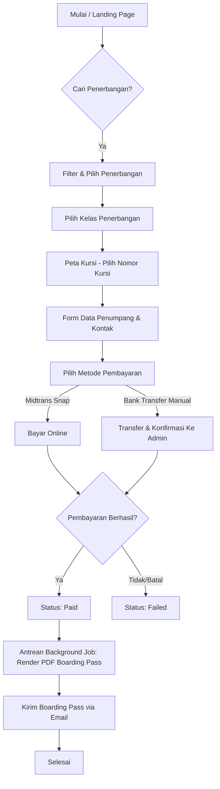

# Product Requirement Document (PRD) - Garuda Flight Booking System

## 1. Pendahuluan

### Latar Belakang
Proyek ini dibangun sebagai sistem e-ticketing penerbangan maskapai Garuda modern berbasis web. Sistem ini ditujukan untuk memfasilitasi transaksi pemesanan tiket penerbangan secara end-to-end, mulai dari pencarian jadwal penerbangan hingga penerbitan boarding pass resmi secara otomatis. Aplikasi dirancang untuk memenuhi standar kesiapan production tingkat tinggi untuk tugas Ujian Akhir Semester (UAS).

### Tujuan Produk
*   Menyediakan platform pemesanan tiket pesawat yang aman, cepat, dan responsif.
*   Mengimplementasikan pencegahan persaingan data (double booking/race condition) pada sistem pemilihan kursi secara real-time.
*   Mengintegrasikan sistem pembayaran digital modern menggunakan Midtrans Snap API.
*   Menyediakan panel administrasi back-office yang tangguh untuk memantau data penerbangan, transaksi, dan aset promosi.

---

## 2. Target Pengguna & Peran (User Personas)

### 1. Pelanggan (Customer / Guest)
*   Melakukan pencarian penerbangan berdasarkan parameter rute dan waktu.
*   Memilih kelas penerbangan, melihat fasilitas kabin, dan memilih nomor kursi secara visual.
*   Melakukan transaksi pembayaran online atau konfirmasi transfer manual.
*   Menerima e-ticket/boarding pass berformat PDF di email mereka.
*   Mencari riwayat pesanan berdasarkan kode transaksi unik.

### 2. Administrator Sistem (Admin)
*   Mengelola master data bandara, maskapai, jadwal penerbangan, dan kelas kabin.
*   Mengenerate tata letak kursi pesawat secara otomatis berdasarkan kapasitas kelas.
*   Mengelola kupon promosi/kode diskon.
*   Memantau riwayat transaksi keuangan dan status reservasi tiket.

---

## 3. Kebutuhan Fungsional (Functional Requirements)

### Modul Penerbangan & Pencarian (UC-01 - UC-04)
*   **Pencarian Penerbangan Dinamis:** Pengguna dapat mencari jadwal penerbangan dengan memilih bandara keberangkatan, bandara tujuan, tanggal penerbangan, dan jumlah penumpang.
*   **Filter Sidebar:** Penyaringan penerbangan berdasarkan maskapai (Airline), fasilitas (Facilities), dan tipe transit (Direct, 1x Transit, 2x Transit).
*   **Pemilihan Kelas (Tiering):** Menampilkan opsi kelas penerbangan (Economy Class, Business Class) beserta fasilitas kabin pendukung (makan malam, bagasi gratis, USB port, WiFi) dan harga masing-masing.

### Modul Pemilihan Kursi Real-Time (UC-05 - UC-06)
*   **Peta Kursi Visual (Visual Grid):** Grid tata letak kursi interaktif. Kursi yang telah terisi (failed/success status) tidak dapat dipilih. Kursi yang terpilih akan berubah warna menjadi maroon/primary.
*   **Validasi Kapasitas:** Batasan pemilihan jumlah kursi harus tepat sesuai jumlah penumpang yang ditentukan di awal pencarian.
*   **Sinkronisasi Real-Time (Polling):** Integrasi Livewire dengan polling 5 detik (`wire:poll.5s`) atau Web Socket listener (`echo:flights,SeatStatusUpdated`) untuk memperbarui status kursi secara langsung tanpa reload halaman.

### Modul Pemesanan & Data Penumpang (UC-07)
*   **Formulir Penumpang:** Mengumpulkan nama lengkap penumpang, tanggal lahir, kewarganegaraan, dan memetakan masing-masing penumpang ke ID kursi yang dipilih.
*   **Validasi Kontak Pemesan:** Wajib menyertakan Nama, Email aktif, dan Nomor Telepon pemesan untuk kebutuhan pengiriman tiket.

### Modul Pembayaran & Integrasi Payment Gateway (UC-08 - UC-09)
*   **Midtrans Snap Integration:** Integrasi pembayaran aman via Midtrans Snap SDK (QRIS, GoPay, BNI VA, BSI VA, Mandiri VA, dan Kartu Kredit).
*   **Transfer Bank Manual:** Pilihan alternatif transfer bank manual (BCA, Mandiri, BNI, BSI) bagi pengguna untuk divalidasi manual oleh admin.
*   **Polling Status Pembayaran:** Halaman snap pembayaran mengecek status transaksi ke server secara berkala untuk redirect otomatis setelah pembayaran sukses.
*   **Sistem Webhook Pembayaran:** Webhook asinkron dari Midtrans untuk mengupdate status transaksi di database (Paid/Success atau Failed/Expired) secara langsung di backend.

### Modul Pengiriman Boarding Pass (UC-10)
*   **Pembuatan PDF Boarding Pass:** Menggunakan DomPDF untuk menghasilkan berkas PDF boarding pass resmi yang dilengkapi dengan detail rute, jam terbang, nomor kursi, data diri penumpang, dan kode QR unik.
*   **Pengiriman Email Otomatis (Queue):** Menggunakan antrean email (`Mail::queue` via Laravel Queue worker) agar rendering PDF yang berat tidak membebangi HTTP response time.

### Modul Riwayat Transaksi & Profil (UC-11 - UC-12)
*   **Cari Booking via Kode:** Pelanggan dapat memasukkan kode transaksi (contoh: `GRD-XXXXXXXX`) di halaman pencarian untuk melihat status pembayaran dan mengunduh boarding pass mereka.
*   **Daftar Pesanan Saya:** Menampilkan riwayat seluruh transaksi milik pengguna yang login secara berurutan.
*   **Manajemen Profil:** Pengguna dapat memperbarui informasi nama, alamat email, dan kata sandi mereka.

---

## 4. Kebutuhan Non-Fungsional (Non-Functional Requirements)

### 1. Keamanan Data (Security)
*   **Proteksi Otorisasi Transaksi:** Setiap aksi melihat detail transaksi atau melakukan pembayaran harus divalidasi oleh `TransactionPolicy` untuk mencegah *Booking Hijacking* (mengakses transaksi milik user lain).
*   **Enkripsi Kata Sandi:** Sandi pengguna disimpan menggunakan algoritma hashing bawaan Laravel (`hashed`).
*   **Row-Level Security (RLS) di Backend:** Pengecekan autentikasi middleware di setiap endpoint sensitif `/booking/*`.

### 2. Integritas Data & Konkurensi (Concurrency Control)
*   **Pencegahan Double Booking:** Menggunakan database transaction (`DB::beginTransaction`) dan penguncian eksklusif database (`lockForUpdate()`) saat proses reservasi kursi.
*   **Validasi Kursi Ganda:** Backend memeriksa kembali apakah kursi yang dipilih telah dipesan oleh transaksi lain yang aktif (pending/paid) tepat sebelum transaksi baru disimpan ke database.

### 3. Performa & Optimasi (Performance)
*   **Indeks Database (Indexes):** Kolom pencarian kritis seperti `code` (unique), `payment_status`, `class_type`, dan `flight_number` diberi indeks database untuk mempercepat query JOIN dan filter data.
*   **Eager Loading:** Membaca data penerbangan menggunakan eager loading (`with(...)` atau `loadMissing(...)`) untuk menghindari masalah query N+1 pada detail pemesanan dan proses rendering boarding pass.
*   **Asynchronous Processing:** Menggunakan queue driver (`database`) untuk memproses pengiriman surel boarding pass di latar belakang.

---

## 5. Arsitektur Database (Schema & Entity-Relationship)

### Entitas Utama
1.  **User:** Menyimpan kredensial pengguna (name, email, password, role).
2.  **Airline:** Menyimpan data maskapai (iata_code, name, logo).
3.  **Airport:** Menyimpan data bandara (iata_code, name, city, country, image).
4.  **Flight:** Jadwal penerbangan (flight_number, airline_id).
5.  **FlightSegment:** Segmen rute penerbangan/transit (sequence, flight_id, airport_id, time).
6.  **FlightClass:** Kategori kabin dan harga tiket (flight_id, class_type, price, total_seats).
7.  **FlightSeat:** Kursi pesawat (flight_id, name, row, column, class_type, is_available).
8.  **PromoCode:** Kupon diskon promosi (code, discount_type, discount, valid_until, is_used).
9.  **Transaction:** Data reservasi utama (user_id, code, flight_id, flight_class_id, payment_status, grandtotal, dll).
10. **TransactionPassenger:** Data detail penumpang dalam reservasi (transaction_id, flight_seat_id, name, date_of_birth, nationality).

---

## 6. Alur Pengguna (User Flow)

